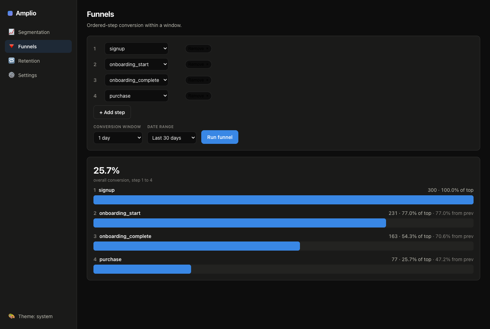
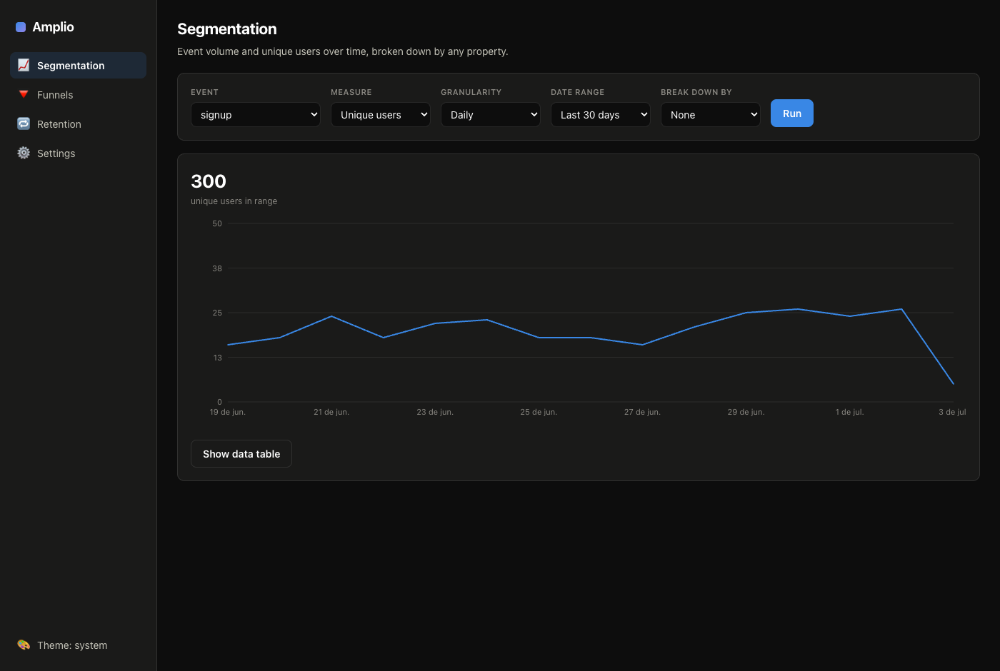
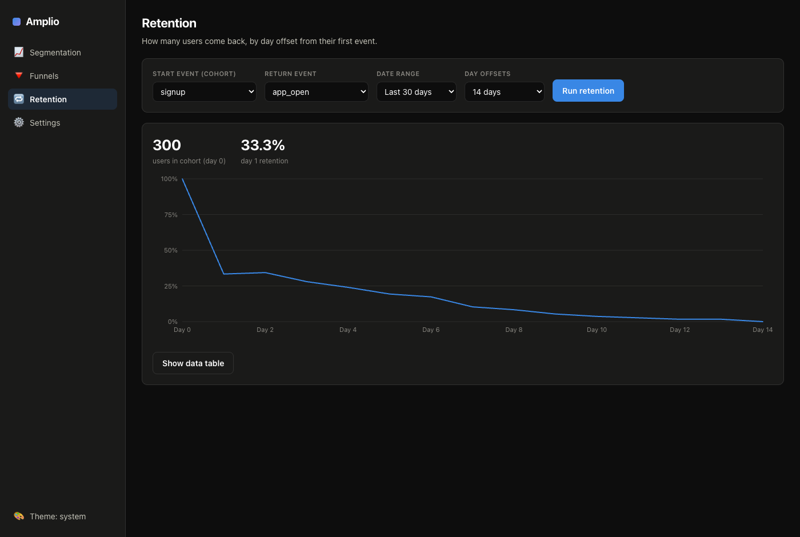

<div align="center">

# Amplio

**Open-source product analytics. An open Amplitude.**

Track events, build funnels, measure retention, explore user journeys, and own every byte of your data. Self-hosted, MIT-licensed, built for collaboration.

[Architecture](docs/ARCHITECTURE.md) · [Roadmap](docs/ROADMAP.md) · [Contributing](CONTRIBUTING.md)

</div>

---

## Why Amplio

Amplitude is the reference for product analytics, but it is closed and priced per event. Amplio rebuilds the same capabilities in the open: event ingestion, segmentation, funnels, retention, cohorts, and dashboards, running on infrastructure you control.

- **Own your data.** Events land in your own ClickHouse. Nothing leaves your servers.
- **Amplitude-compatible.** The ingestion API mirrors Amplitude's HTTP V2 contract, so existing SDKs and event schemas port over with minimal changes.
- **Built to scale.** ClickHouse for the event columnar store, Postgres for metadata. The same architecture real analytics platforms run on.
- **MIT-licensed.** Use it, fork it, ship it. No open-core bait and switch.

## Status

Early and moving fast. See the [roadmap](docs/ROADMAP.md) for what is live and what is next.

| Component | Status |
|-----------|--------|
| Event schema (shared types) | 🟢 done |
| Ingestion API (`/2/httpapi`, `/batch`) | 🟢 done |
| ClickHouse storage | 🟢 done |
| Query engine (funnels/retention/segmentation) | 🟢 done |
| Query API | 🟢 done |
| Browser SDK (also runs in Node) | 🟢 done |
| Dashboard UI (segmentation, funnels, retention) | 🟢 done |
| Self-host deploy | 🟡 next |

## Dashboard

Segmentation, funnels, and retention, with a live chart builder against your own data.



<details>
<summary>More views</summary>




</details>

## Architecture at a glance

```
  SDKs / HTTP  ─▶  Ingest API  ─▶  ClickHouse (events)
   (browser,        (Fastify,          columnar store
    node, curl)      zod, auth)              │
                                             ▼
   Dashboard   ◀──  Query API   ◀──  Query engine
   (React)          (Fastify)        (funnels, retention,
                        │             segmentation, cohorts)
                        ▼
                   Postgres (projects, api keys,
                             charts, dashboards)
```

Full detail in [docs/ARCHITECTURE.md](docs/ARCHITECTURE.md).

## Quick start (local dev)

Requires Node 20+, pnpm, and Docker.

```bash
pnpm install
pnpm stack:up        # ClickHouse + Postgres via docker compose
pnpm dev             # run services in watch mode
```

Send a test event:

```bash
curl -X POST http://localhost:8787/2/httpapi \
  -H 'content-type: application/json' \
  -d '{
    "api_key": "dev-key",
    "events": [
      { "event_type": "signup", "user_id": "u_123", "event_properties": { "plan": "pro" } }
    ]
  }'
```

## Repository layout

```
apps/
  ingest/     Event ingestion service (Amplitude-compatible HTTP API)
  api/        Query + dashboard backend
  web/        React dashboard
packages/
  schema/     Shared event types and validation (zod)
  query/      Analytics query builders (funnels, retention, segmentation)
  sdk-browser/ Browser tracking SDK
deploy/       docker-compose, ClickHouse + Postgres init
docs/         Architecture, roadmap, guides
```

## Contributing

Amplio is built in the open and welcomes contributors. Read [CONTRIBUTING.md](CONTRIBUTING.md) and pick up anything from the [roadmap](docs/ROADMAP.md) or open issues.

## License

MIT. See [LICENSE](LICENSE).
